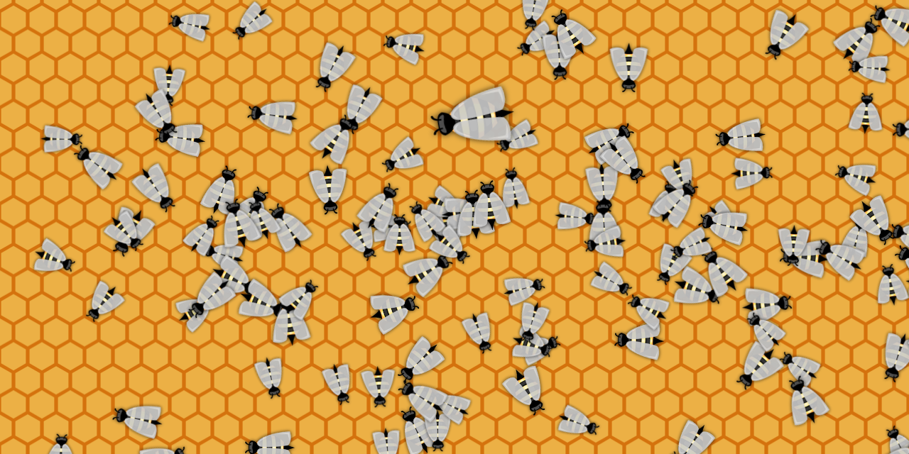

# National Honey Bee Day Door Competition Entry 🐝

**Can you find the queen bee?**

**[See it in action](https://cityssm.github.io/national-bee-day)**

## About National Honey Bee Day

> **National Honey Bee Day** (formerly National Honey Bee Awareness Day) is an awareness day when beekeepers, beekeeping clubs and associations, and honey bee enthusiasts from across the United States celebrate honey bees and recognize their contribution to humans' everyday lives as a means of protecting this critical species. National Honey Bee Day also pays homage to beekeepers, whose labors ensure there are well-managed, healthy bees to pollinate crops. - [Wikipedia](https://en.wikipedia.org/wiki/National_Honey_Bee_Day)

National Honey Dee Day 2024 takes place **Saturday, August 17th, 2024**.

## Credits

[Bug script by Auz](https://github.com/Auz/Bug) 
Script to generate and animate the bees.

[Honeycomb background by Thomas Tortorini](https://codepen.io/mr21/pen/WgyYWM) 
Recolored to look like honeycomb.

[Bee Sprite by Game Art Guppy](https://www.gameartguppy.com/shop/bee/)

## Related

[Canada Day Fireworks](https://github.com/cityssm/canada-day-fireworks) 
A fireworks show for the 2023 Canada Day door competition!
